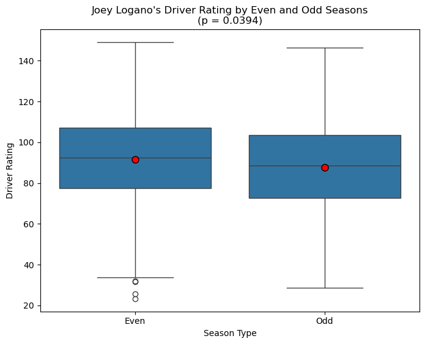
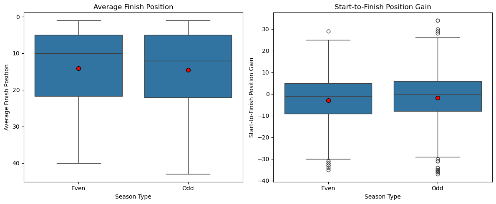
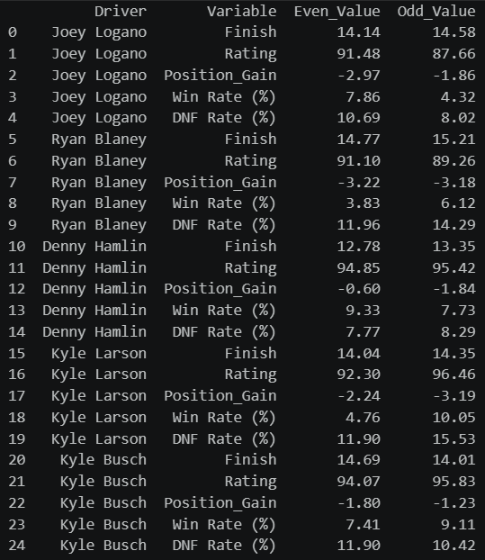
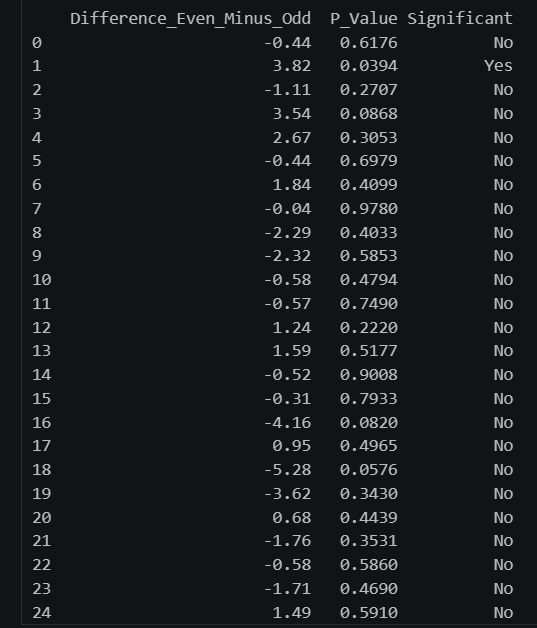
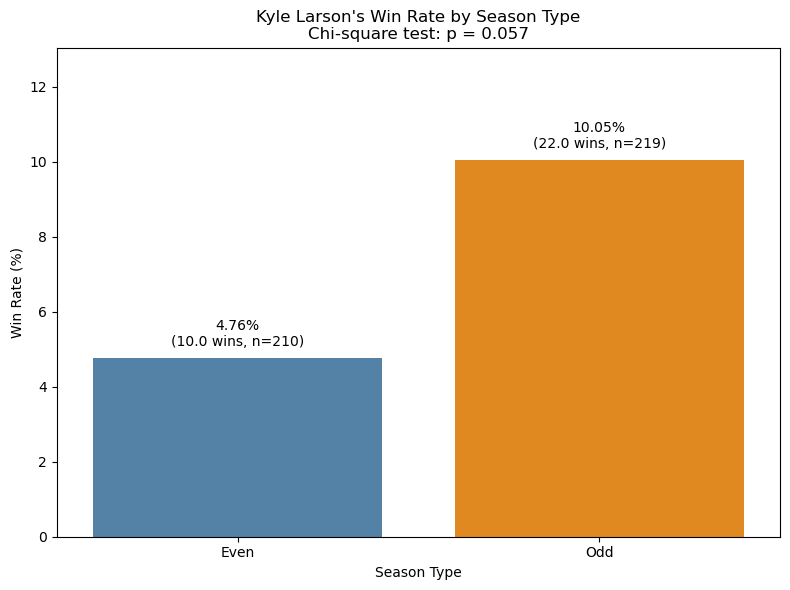

## Visualizations and Insights

In conclusion, it was found that at the 95% confidence level, there was a significant difference in driver ratings for Logano between even and odd years, with a p-value of 0.0394.

His average rating was 91.48 in even years compared with 87.66 in odd years. This suggests that the observed difference is unlikely to be due solely to random variation. However, Driver Rating is a variable made up of multiple factors, and this result does not prove that being an even-numbered year caused his stronger performance.

Another visual, although non-significant, showed that there was a slight increase in the median average finish in even years, but also showed slightly worse median position gain.

When looking at other drivers, this is the complete comparison in even vs odd values.

When p-values were checked completely, Logano's driver variable was still the only variable that was significant at the 0.05 level.

Another interesting insight, although slightly non-significant, was that Kyle Larson has a more than 100% increase in win rate in odd years vs even years, even with more races completed in odd years, although he was suspended in an even year for a racially insensitive comment.

## So, in conclusion, the story tells that, for the most part, there is no significant difference between even and odd years for the variables that were observed. But Logano has a significant difference in driver rating between even and odd years, suggesting that the nickname "Even Year Logano" is warranted due to his seemingly better results in those years.
